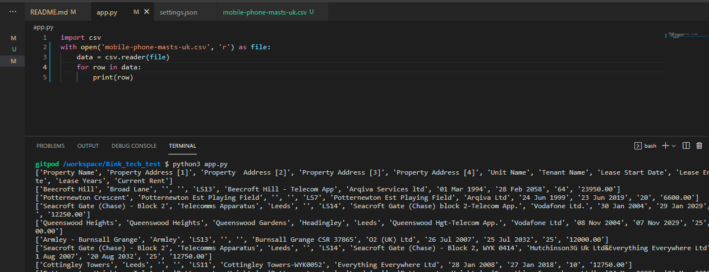
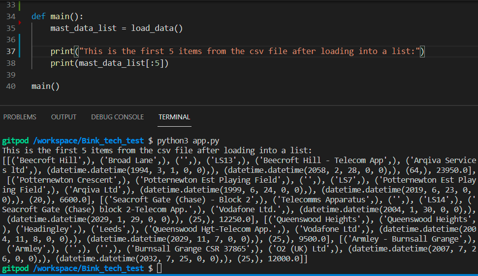
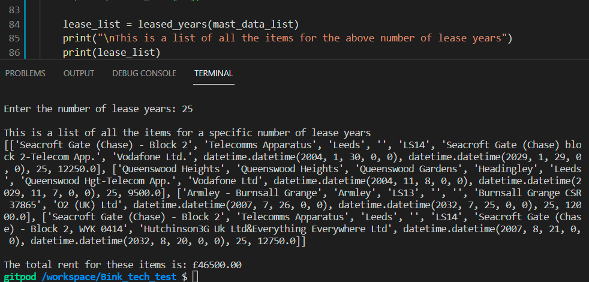
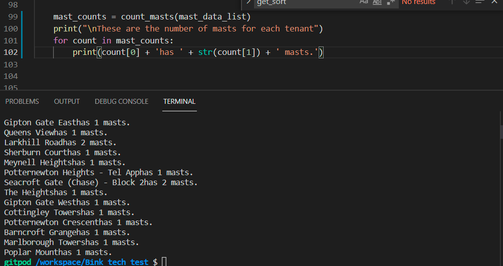

# Bink Technical Test

## **Project Objective** 
A data file will be provided alongside this test. The dataset is a CSV which contains publicly available data about mobile phone masts in an area of the UK. This file contains un-normalised data (such as multiple variations of Tenant Name) – treat these as individual tenants.

### Actions
1.	Load the data file, process and output the data in the forms specified
2.	Read in, process and present the data as specified in the requirements section
3.	Demonstrate usage of list comprehension for at least one of the tasks
4.	Allow user input to run all of your script, or specific sections

## Requirements
1.	Read in the attached file
    a.	Produce a list sorted by “Current Rent” in ascending order
    b.	Obtain the first 5 items from the resultant list and output to the console
2.	From the list of all mast data, create a new list of mast data with “Lease Years” = 25 years.
    a.	Output the list to the console, including all data fields
    b.	Output the total rent for all items in this list to the console
3.	Create a dictionary containing tenant name and a count of masts for each tenant
    a.	Output the dictionary to the console in a readable form
4.	List the data for rentals with “Lease Start Date” between 1st June 1999 and 31st August 2007
    a.	Output the data to the console with dates formatted as DD/MM/YYYY

## Table of contents 
* [User Stories](#user-stories)
* [Test Evidence](#test-evidence)

--- 

## **User Stories**

* [#01] - As a user I want a list of the mobile phone masts sorted by `Current Rent`.
* [#02] - As a user I want a list of the first 5 items of the mast list data in #01 output to the console.
* [#03] - As a user I want a list of the mast data where the `Lease Years` = 25 containing all data fields.
* [#04] - As a user I want the total rent for all items in the mast data list in #03 to be output to the console.
* [#05] - As a user I want ta dictionary containing the tenant name and a count of masts for each tenant output to the console in a readable form.
* [#06] - As a user I want a list of retals with `Lease Start Date` between 1 June 1999 abd 31 August 2007 with the date formated as DD/MM/YYYY.

[Back to Top](#table-of-contents)

## **Test Evidence**

### Test if data loads from csv file.
I used a for loop and print operation to check the csv data had loaded into `data` 

### First 5 items of csv after loading into Python list.
I realised when I initially sorted the data by `Current Rent` the sort was incorrect. This was because I had not converted the data into correct data types. `Current Rent` was initially a string from the csv.  This image shows the data elements have the correct data types 

### First 5 items after data is sorted by `Current Rent`. 

### Records `Lease Years` = 25 and total rent for these records
The user is asked to enter the lease year term. In this image the term was 25 years.

### The numebr of masts for each tenant

* [#06] - As a user I want a list of retals with `Lease Start Date` between 1 June 1999 abd 31 August 2007 with the date formated as DD/MM/YYYY.

[Back to Top](#table-of-contents)

